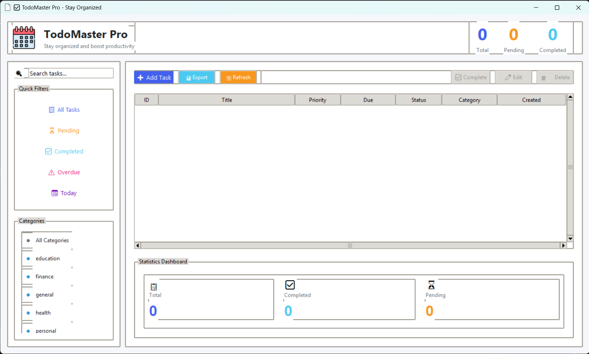
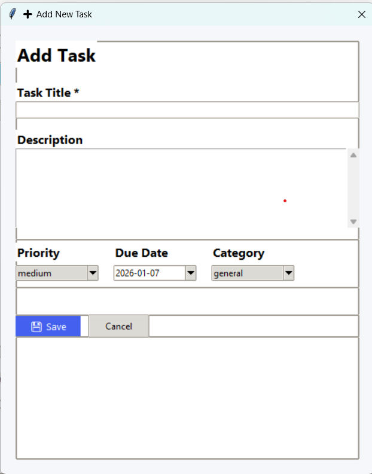
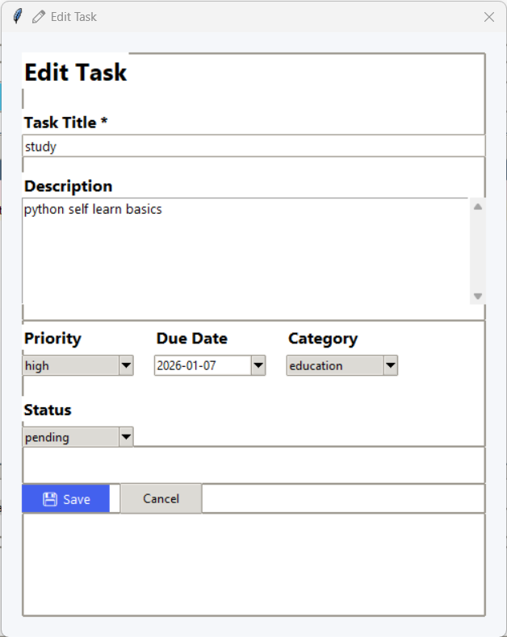

# TodoMaster Pro 📝



A modern, feature-rich Todo List application built with Python and Tkinter. Stay organized, boost productivity, and manage your tasks efficiently with this beautiful desktop application.

## ✨ Features

### 🎯 Core Features
- **Task Management**: Create, edit, complete, and delete tasks
- **Priority Levels**: High, Medium, Low priority tagging
- **Categories**: Organize tasks into custom categories
- **Due Dates**: Set deadlines with calendar widget
- **Search & Filter**: Quick search and advanced filtering
- **Statistics Dashboard**: Visual progress tracking

### 🎨 Modern UI
- **Clean Interface**: Material-inspired design
- **Dark/Light Theme**: Built-in theme support
- **Responsive Layout**: Adapts to window size
- **Visual Indicators**: Color-coded priorities and statuses
- **Progress Bars**: Completion rate visualization

### 📊 Advanced Features
- **Export Data**: Export tasks to CSV format
- **Task Statistics**: Comprehensive analytics dashboard
- **Keyboard Shortcuts**: Quick navigation
- **Auto-save**: Never lose your data
- **Backup System**: Automatic database backups

### 🔧 Technical Features
- **SQLite Database**: Fast and reliable data storage
- **Thread-safe**: Multi-threading support
- **Error Handling**: Graceful error recovery
- **Logging**: Comprehensive activity logging
- **Configuration**: Customizable settings

## 📸 Screenshots

| Main Interface | Add Task | Edit Task |
|----------------|--------------|------------|
|  |  |  |

## 🚀 Installation

### Prerequisites
- Python 3.7 or higher
- Tkinter (usually included with Python)

### Quick Install (Recommended)

1. **Clone the repository:**
```bash
git clone https://github.com/paruvez/to-do-python.git

cd to-do-python

